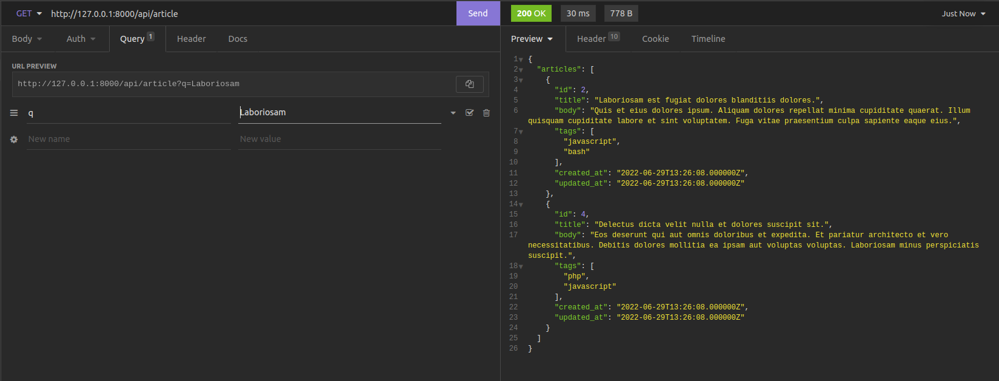

<p align="center"><a href="https://laravel.com" target="_blank">
</a>
</p>

## Laravel and Elasticsearch

example of simple laravel integration with elasticsearch to optimize search queries

## Prerequiste

-   [Composer](https://getcomposer.org/) - Download and Install Composer

### Installation

Install the dependencies and start the server.

```sh
$ git https://github.com/Zainal21/Laravel-ElasticSearch.git
$ cd /Laravel-ElasticSearch
$ composer install
$ cp .env.example to .env
$ change configuration database & generate key with php artisan key:generate
$ Call Action to Migrate Database & seeder with php artisan migrate --seed
$ change configuration elasticsearch client in env file, such us host, username, password and port
$ php artisan serve
$ test in your rest-api-client tools (Insomnia, Postman, Thunder Client .etc)
```

### Example Result

example of simple search articles using elasticsearch



2022 © Zainal21
